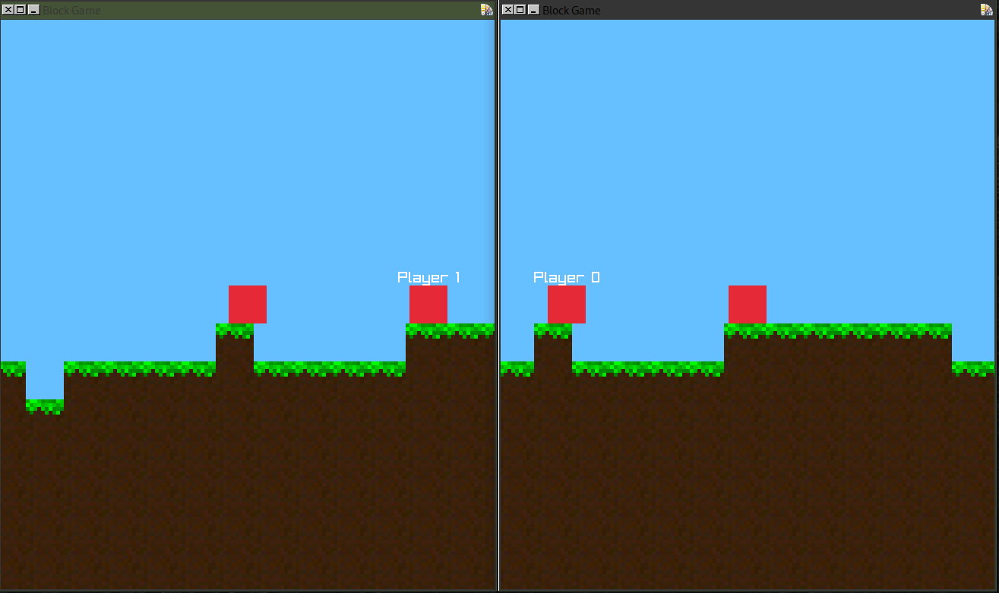

# raylib game

Simple raylib game made in C++. It's not feature complete but can serve as a basic template. It generates terrain using 2D Perlin Noise and uses UDP packets for simple and basic multiplayer functionality. 

You can run the server accompanied with a port number:
`./server <port-value>`

